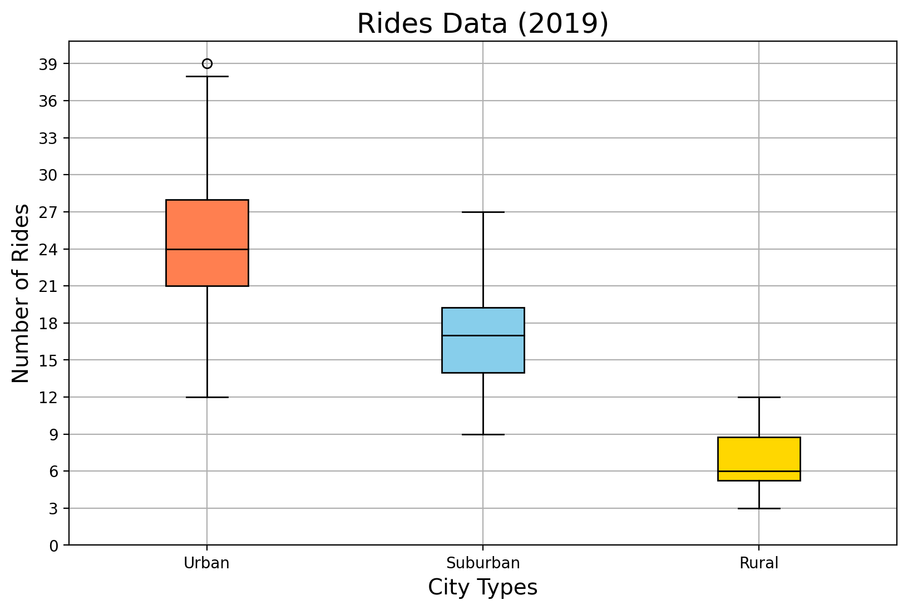

# PyBer City Type Analysis


## Overview


## Results


| CityType | TotalRides | TotalDrivers | TotalFares | AverageFareperRide | AverageFareperDriver |
|-------- |---------- |------------ |---------- |------------------ |-------------------- |
| Rural    | 125        | 78           | $4,327.93  | $34.62             | $55.49               |
| Suburban | 625        | 490          | $19,356.33 | $30.97             | $39.50               |
| Urban    | 1,625      | 2,405        | $39,854.38 | $24.53             | $16.57               |




| date       | Rural  | Suburban | Urban   |
|---------- |------ |-------- |------- |
| 2019-01-06 | 187.92 | 721.60   | 1661.68 |
| 2019-01-13 | 67.65  | 1105.13  | 2050.43 |
| 2019-01-20 | 306.00 | 1218.20  | 1939.02 |
| 2019-01-27 | 179.69 | 1203.28  | 2129.51 |
| 2019-02-03 | 333.08 | 1042.79  | 2086.94 |


## Summary

1.  Reduce the amount of drivers in the Urban areas.
2.  Increment the amount of drivers in the Rural areas.
3.  Move drivers from certain cities in the Urban areas to other cities in the urban areas. For example, the outliers in the Urban areas.
4.  The Rural fares are also too spread, we can try to make sense from the city size, as large distances may increase the fares. Plus the low amount of drivers can alter the demand in a negative way.
5.  Alternatively, we can send drivers from Suburban to Rural and from Urban to Suburban as adapting may be easier.


## Closing Thoughts

```python
from pyberlib import Pyber

chart = Pyber.plot_bubble_combined(
    total_rides_per_city_type,
    average_fares_per_city_type,
    average_drivers_per_city_type
)
Pyber.savefig(chart, "ridesharing_all.png")
```
